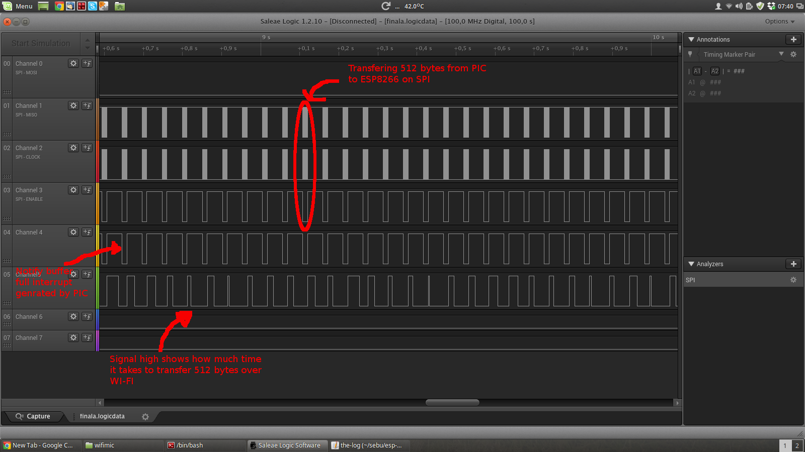

# wifimic
Transfer voice over WI-FI with an ESP8266 and PIC18F25K22 microcontroller.

# Schematic in GhettoCAD:

# How it works:

PIC18 MCU reads and buffers 512 audio samples from the microphone using its ADC. Sampling frequency is 10KHz with 8 bits resolution.

When the buffer is full, PIC18 notifies ESP by pulling low a GPIO(RB4 on PIC18 - GPIO9 on ESP). This GPIO triggers an interrupt in the ESP.

ESP8266 transfers those 512 samples from PIC18 to its internal memory and then it sends them over WiFi.

The transfer between PIC18 and ESP8266 happens over SPI, where ESP is the master and PIC the slave.

Here's a logic analyzer capture:

Add your WiFi credentials in the `user_set_station_config` function for ESP8266 to connect to the WiFi AP.
 
After ESP8266 is connected to WiFi, it will send audio data to a listening server IP on port 1235. Set the server IP in function `serv_tcp_connect`.

In order to listen to the audio from you computer you should start a server with `nc` and pipe the audio data to `aplay`:

**nc -l 1235 | aplay -r 10000 -f U8**

Youtube demo:
https://www.youtube.com/watch?v=bxUD8CM0LWY
